# Shopping Cart Web Application

## Overview
This is a web application for managing an online shopping cart with both user and admin interfaces. It's built using Node.js, Express.js, MongoDB and Handlebars, Bootstrap for the frontend. The application allows users to view products, add them to the cart, place orders with cash on delivery or online payment, and view their order history. Admins can manage products, users, and orders.

## Features
- User Side:
  - View products
  - Add products to the cart
  - Place orders with Cash on Delivery (COD) or Online Payment
  - View order history
  - Use AJAX for enhanced user experience

- Admin Side:
  - View product list
  - Add, edit, and delete products
  - Manage users
  - Manage orders and update their status
  - 
## User Side

### User login
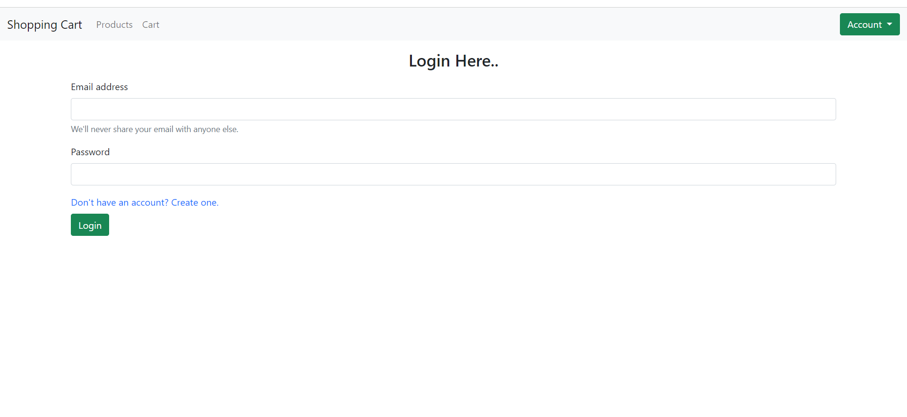

### User sign up
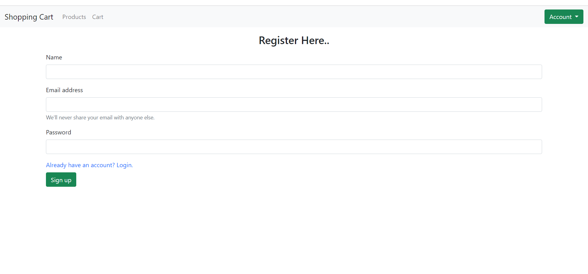

### View products
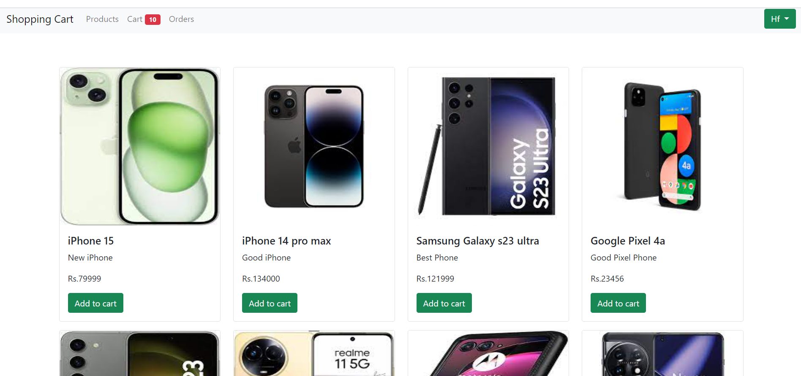

### Cart
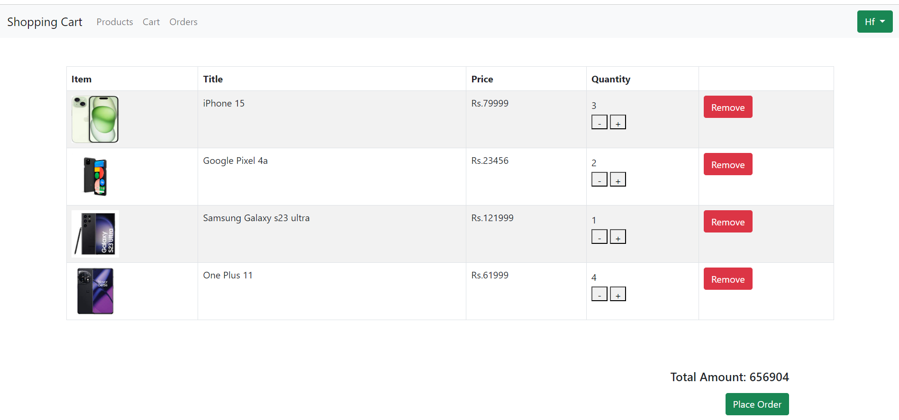

### Place order
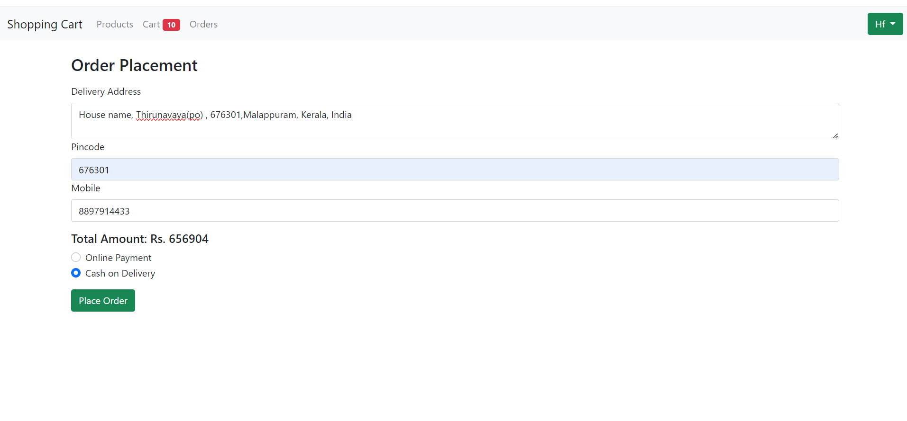

### Online payment
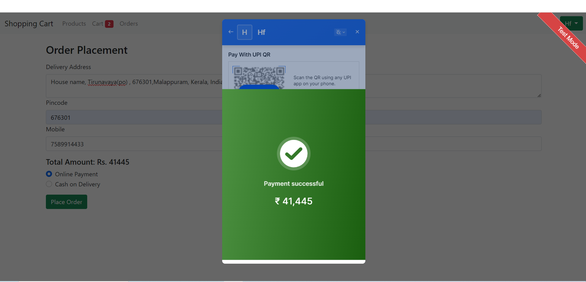

### Order summary
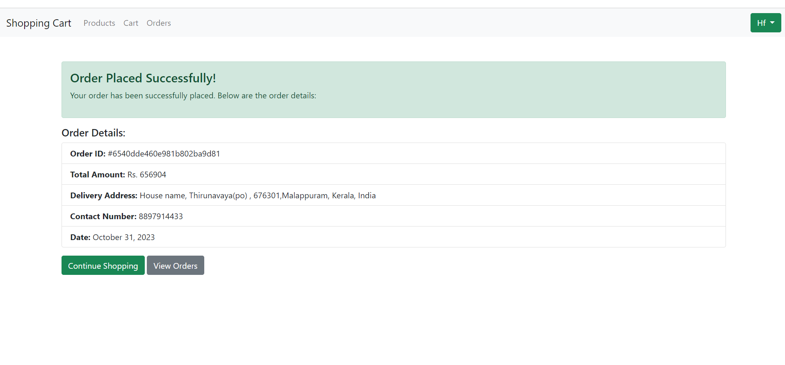

### Orders
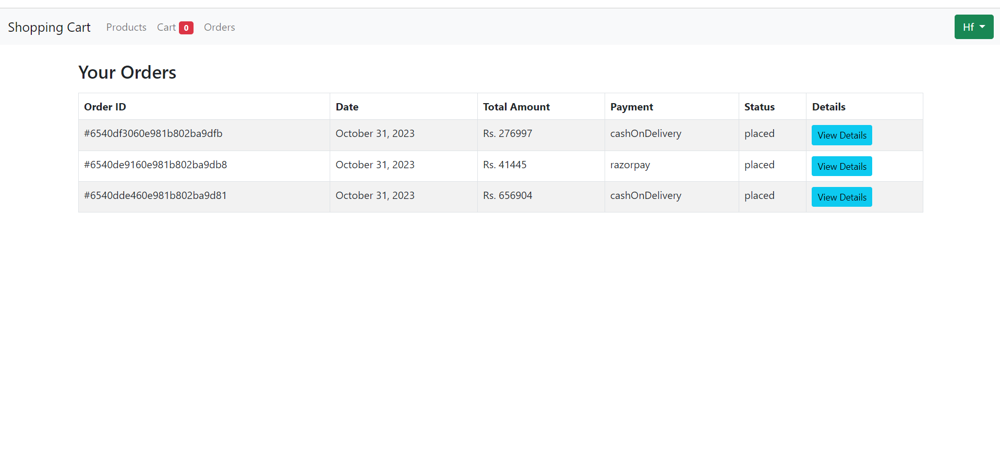

### Order details
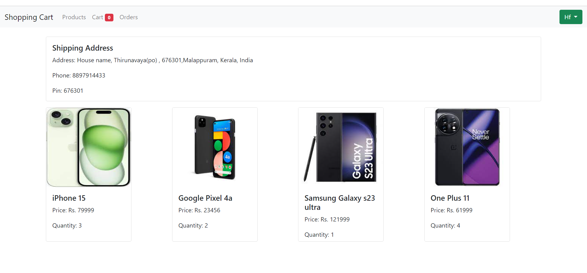

## Admin Side

### Product list
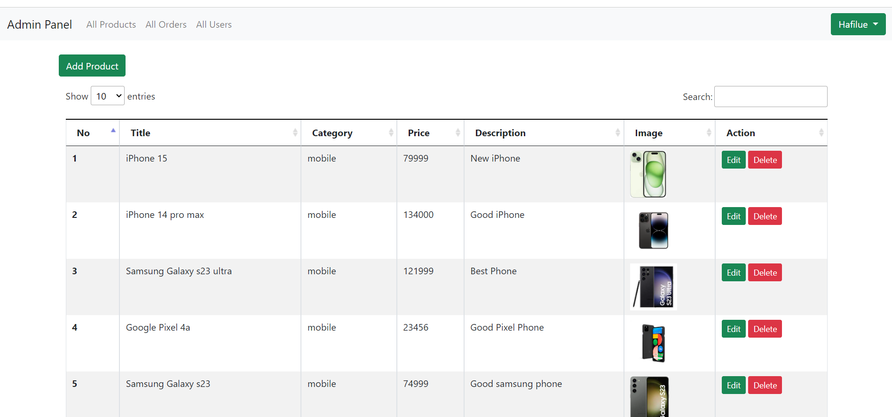

### Search product
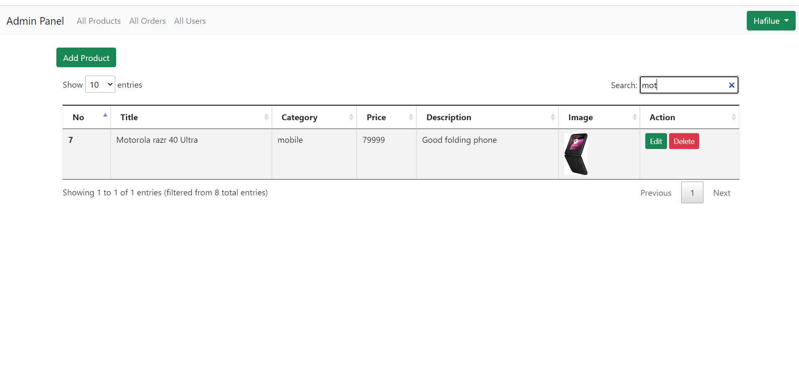

### Add products
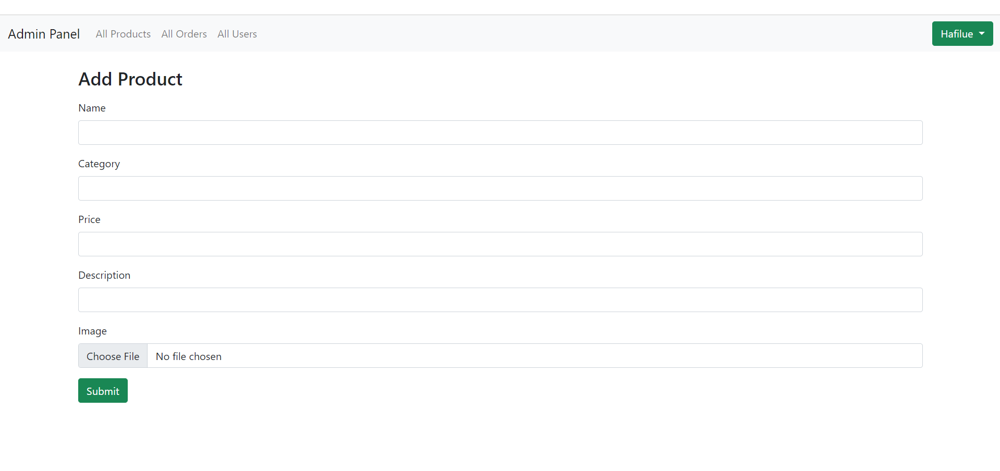

### Edit products
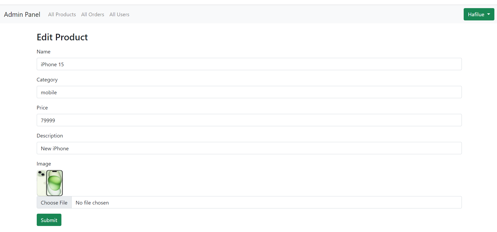

### All orders
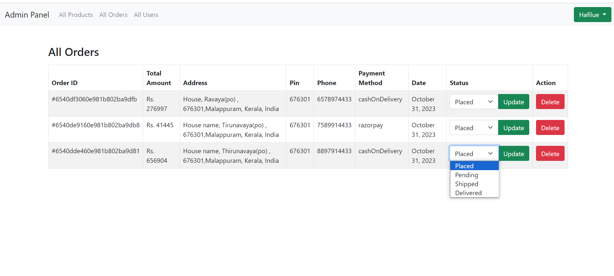

### All users
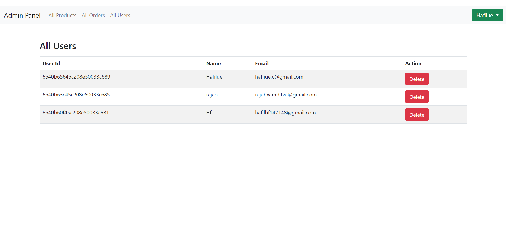

## Installation

### Prerequisites
- Node.js installed
- MongoDB installed and running

1. Clone the repository:

   ```bash
   git clone https://github.com/your-username/shopping-cart.git

   cd shopping-cart

   npm install

Create a .env file in the root directory.
Add the environment variables and configure them as needed

   npm start

The application should now be running on http://localhost:3000.


## Usage
- Open a web browser and go to http://localhost:3000 to access the user interface.
- Log in as an admin to access the admin interface.
- Use the different features as described in the Features section.

## Contributing
If you'd like to contribute to this project, please contact me.

## Acknowledgments
Thank Brototype Malayalam for helping me to create this project


